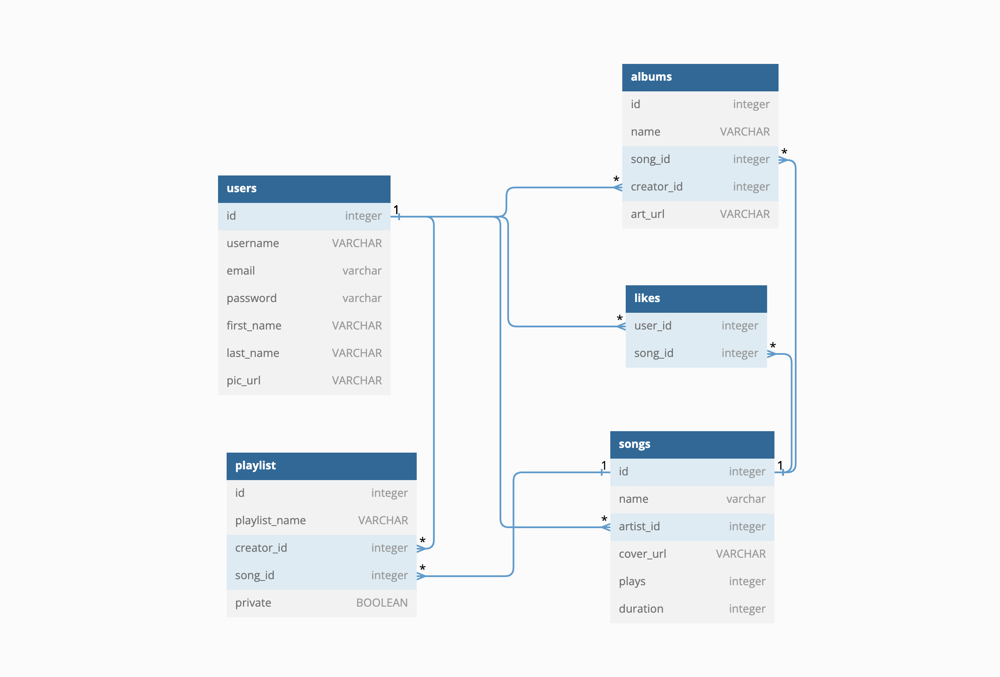
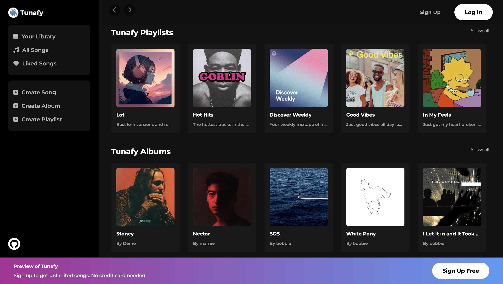
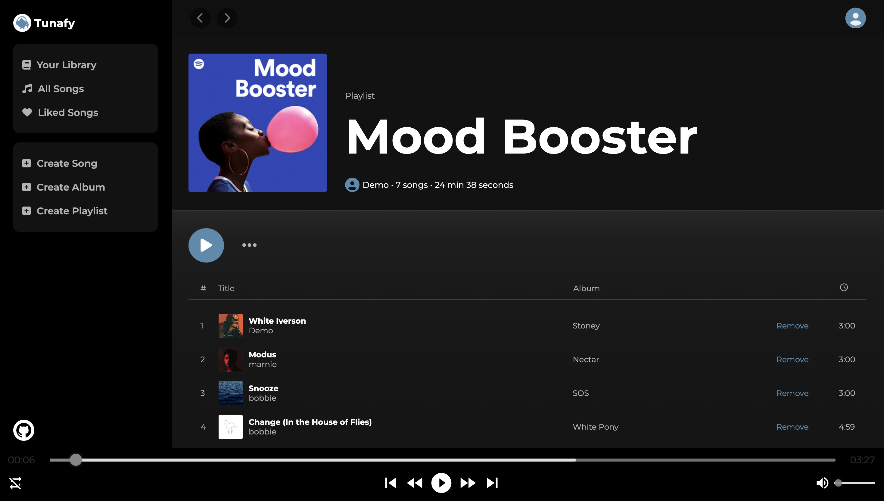
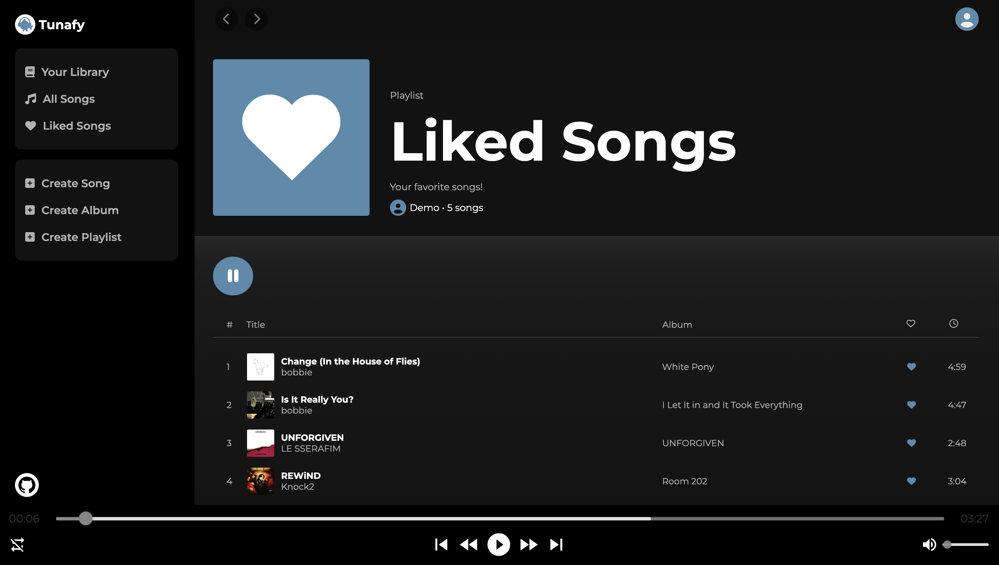

# Tunafy

Tunafy is a music site inspired by Spotify. On this site, users can play, like, and upload songs, as well as, create playlists and albums.

# Live Link

https://tunafy-project.onrender.com/

# Tech Stack

### Languages

### Frameworks and Libraries

### ORM

### Database

### Hosting

### Object Storage

### Design

# Database Schema

# User Stories

### Unauthorized User
When I visit the site as an unauthorized user, I will see a list of playlists and albums each with a cover photo, name, and short description. On the left side, I will see a side bar that navigates to 'Your Library', 'All Songs', and 'Liked Songs'. I will also see the options to 'Create Song', 'Create Album', and 'Create Playlist'. If I click any of the features besides the 'Sign Up' or 'Log In' button, it will show a 'Log In' modal.

### Log In
When I click on the 'Log In' button, I will be redirected to a new page where I will be prompted for an email and password. If I wish to sign up instead, there is a link below the 'Log In' form that redirects to the 'Sign Up' page. On successful login, I am redirected to the home page.

### Sign Up
When I click on the 'Sign Up' button, I will be redirected to a new page where I will be prompted for an email, username, password, and confirm password. If I wish to log in instead, there is a link below the 'Sign Up' form that redirects to the 'Log In' page. On successful sign up, I am redirected to the home page.

### Log Out
The 'Log Out' option will be in the dropdown menu when you click on the profile icon on the top right of the site. When I click on the 'Log Out' option, I will be redirected to the home page.

### Authorized User
When I am logged in as an authorized user, I will see a list of playlists and albums each with a cover photo, name, and short description. On the left side, I will see a side bar that navigates to 'Your Library', 'All Songs', and 'Liked Songs'. I will also see the options to 'Create Song', 'Create Album', and 'Create Playlist'. When I click on any of the features, it will redirect to the corresponding page. On the top left, I will see back and forward buttons to redirect to the previous or next page. On the top right, I will see a profile icon. When I click on it, it will show a dropdown menu including my username, my email, and the 'Log Out' option. At the bottom of the site, I will see an audio player with a play button, pause button, next button, previous button, fast-forward button, shuffle button, progress bar, and volume slider.

### Create a Song
When I click on 'Create Song' on the left side bar, I will be redirected to the 'Create a Song' page. I will see a form that prompts for a song name, cover photo, and song file. On successful creation, I am redirected to the created song's detail page. The song detail page shows the song cover photo, song name, song creator, song duration, play button, like button, and ellipsis with a dropdown menu including an 'Add to Playlist' option, an 'Add to Album' option, an 'Update' option, and a 'Delete' option.

### Create an Album
When I click on 'Create Album' on the left side bar, I will be redirected to the 'Create an Album' page. I will see a form that prompts for an album name and cover photo. On successful creation, I am redirected to the 'Tunafy Albums' page. The album detail page shows the album cover photo, album name, album creator, song count, album duration, play button, and ellipsis with a dropdown menu including an 'Update' option and a 'Delete' option. If the album has songs in it, it'll show each song's number, cover photo, name, creator, album, and duration. As the owner of the album, I can remove songs by clicking on the 'Remove' link next to the duration of each song.

### Create a Playlist
When I click on 'Create Playlist' on the left side bar, I will be redirected to the 'Create a Playlist' page. I will see a form that prompts for a playlist name, cover photo, and description, and an option to make the playlist private. On successful creation, I am redirected to the 'Tunafy Playlists' page. The playlist detail page shows the playlist cover photo, playlist name, playlist creator, song count, playlist duration, play button, and ellipsis with a dropdown menu including a 'Delete' option. If the playlist has songs in it, it'll show each song's number, cover photo, name, creator, album, and duration. As the owner of the playlist, I can remove songs by clicking on the 'Remove' link next to the duration of each song.

### All Songs
When I click on 'All Songs' on the left side bar, I will be redirected to the 'All Songs' page. This page shows all the songs in Tunafy's library. When I click on the ellipsis, it shows a dropdown menu including a 'Create' option.

### Liked Songs
When I click on 'Liked Songs' on the left side bar, I will be redirected to the 'Liked Songs' page. This playlist shows all the songs that I like. In each song tile, there is a blue heart. When I click on the blue heart, a modal shows asking if I want to remove the song from the 'Liked Songs' playlist.

# Landing Page

# Playlist Detail Page

# Liked Songs Page

# Feature List

1. Songs
   * Users should be able to view all songs.
   * Users should be able to upload songs.
   * Users should be able to update their uploaded songs.
   * Users should be able to delete their uploaded songs.
2. Albums
   * Users should be able to view all of their albums.
   * Users should be able to add songs to an album they created.
   * Users should be able to remove songs from their albums.
   * Users should be able to update their albums.
   * Users should be able to delete their albums.
3. Likes
   * Users should be able to view all of their liked songs.
   * Users should be able to like a song.
   * Users should be able to unlike a song.
4. Playlists
   * Users should be able to view all of their playlists.
   * Users should be able to add songs to a playlist they created.
   * Users should be able to remove songs from their playlists.
   * Users should be able to delete their playlists.

# Future Features

1. WaveForms
   * Users should be able to see the wave forms for a song.
2. Search
   * Users should be able to search for songs by artist or song name.
   * Users should be able to view the results of their search.

# Connect

1. Project
   * [GitHub](https://github.com/samis0216/tunafy)
2. Lyndon Thomasz
   * [LinkedIn](https://www.linkedin.com/in/lyndon-thomasz-3a091126a/)
   * [GitHub](https://github.com/LThomasz)
3. Nicole Le
   * [LinkedIn](https://www.linkedin.com/in/nicolehuyenle/)
   * [GitHub](https://github.com/nicolehuyen)
4. Sami Samman
   * [LinkedIn](https://www.linkedin.com/in/sami-s-4a6a17129/)
   * [GitHub](https://github.com/samis0216)
5. Victoria Nguyen
   * [LinkedIn](https://www.linkedin.com/in/victoria-nguyen-945771239/)
   * [GitHub](https://github.com/vknguyenn)
