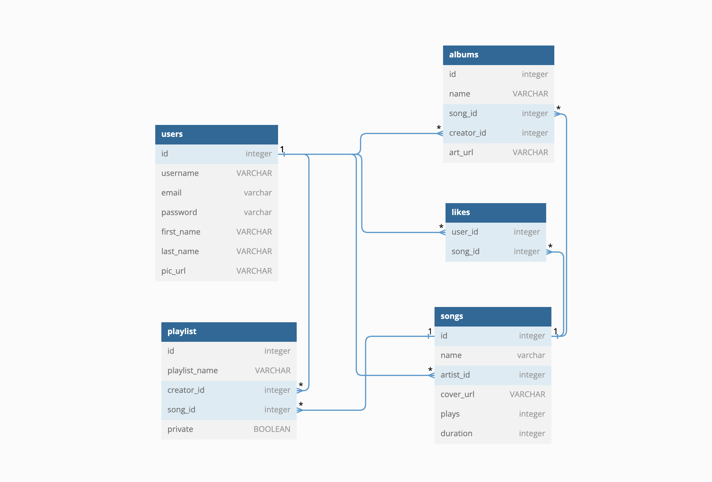

# Schema Diagram

# Unauthorized user
As an unauthorized user when I visit the site I will see a list of popular playlists each with a name, a short description, and cover art. I should be able to see in the footer of the website, relevant links to github, social media links, etc. On the left side should be a navbar that I can use to navigate to different parts of the website including the search, homepage, and a create playlist button in the library section that prompts user to signup or login. If I click to play a song I should be prompted to make a free account in a modal.

# Login
When pressing the button to log in, I should be taken to a new page where I will be prompted for email or username and password. There should also be a sign up link that redirects you to the signup page. On successful login I am redirected to home.

Required:
Username/Email and password

# Signup
When pressing the button to sign up, I should be taken to a new page where I will be prompted for my email address, then a password. There should also be a log in link that redirects you to the login page. On successful signup I am redirected to home.

## Required:
### Email
### Password
* Password should contain at least 8 characters.
The password must contain at least 8 characters. We recommend including at least 1 number and 1 special character.
### Name
* Not empty
### Date of Birth
* Not empty
* Must be older than thirteen

## Optional:
* Gender

# Logout
The logout button should be in a dropdown menu in the top right of the site, and should redirect me to the home page on successful logout.

# Authorized User
As an authorized user when I am logged in to the website I am redirected to a personalized home page with recently listened to music and saved albums/playlists. I should see a profile button in the top right with a Profile option and a Logout option on every page of the website. I should see a Home button in the top left that redirects me to home from any page in the website. Underneath the home button I should see a Upload album button that redirects me to a new page where I can upload a new album and a your library tab that has a button to make a new playlist. I should see an integrated player on the bottom of the page for the current song I am listening to, that has a play button, pause button, next and last song buttons, like button, shuffle button, progress bar, and volume slider.

# Profile page
On the top of my profile page, I should see a profile header on the top of the page with my profile icon, username, and number of public playlists, and a button to edit my profile that takes me to a edit profile modal. Underneath the profile header I should see my created albums, top songs, and my created public playlists. Next to each should be a Show all button that redirects to another page containing the rest of the content.

# Profile edit modal
In the edit profile modal, I should be able to change my account name and/or picture.

# Create a Playlist
On clicking the plus button that is in the Your Library section, I should be taken to a new page that has a blank playlist, with a default name of the latest number playlist created. I should be able to add a photo to my playlist, rename my playlist, and/or add a song from the list provided.
When I have added a song, it should have a button on the very right that has a dropdown that contains a remove from playlist option, a like option, a go to artist page and go to album page option. Each song should have the numbered position in playlist, album cover art, artist name, song name, album name, date added, and duration.

## Liked Songs Playlist
Inside the Library section should be a auto-created playlist that contains all the songs liked by the user.

# Create an Album
On the create an album page, I should be able to upload songs, delete songs, update a song, name the album, and upload album art. For a created album, I should be able to see a header that contains the album name, album cover, artist name, year added, number of songs, and duration. Underneath should be a play button, like button, and a drop down that contains an add to Library option, add to Playlist option, and a Delete album option. There should be the list of songs and each song should have its number, name, artist name and duration.
